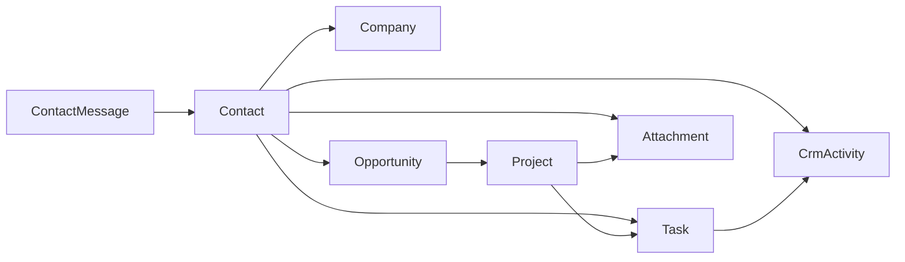

# Consolidação do CRM BURI-TI

Documento de revisão do sistema actual e roteiro de melhorias para consolidar o CRM comercial (estado em julho/2026). Complementa o [`README.md`](../README.md).

## 1. Visão actual

O produto une **site institucional** e **CRM operacional** no mesmo Laravel app:

```text
Site (lead) → Mensagem → Contato → Oportunidade → Projeto → Tarefa/Agenda
                              ↓
                         Atividades (timeline)
                              ↓
                    Anexos · Telegram · Google
```

Objetivo de consolidação: uma **única fonte de verdade** por relacionamento comercial, com condução clara (o que aconteceu, o que falta, o que vale) — sem duplicar dados nem fechar reuniões “por acidente”.

### O que já está sólido

| Capacidade | Estado |
|---|---|
| Funil mensagem → contacto → oportunidade → projeto → tarefa | Operacional no admin + bot |
| Ficha do contacto (dossier) | Hero unificado, timeline, pasta, mini-calendário |
| Atividade ↔ reunião | Vínculo opcional; conclusão **explícita** (`complete_task` / Telegram `concluir`) |
| Trend de notas na mesma reunião | Edição de atividade + expand na agenda |
| Anexos | Lixeira, auditoria, preview inline (PDF/imagem/média/texto) |
| Agenda | Calendário / agenda / board / lista + Google + Meet + ICS |
| Projetos | Board com ordenação vertical (`sort_order`) |
| Segurança admin | Sessões revogáveis, audit logs, CSP, throttle |
| Canal Telegram | CRUD dos principais entidades + card comercial + lembretes |

### Lacunas conhecidas (README antigo vs código)

Já endereçadas no README actualizado: CRM comercial completo, `/atividade`, preview de anexos, conclusão opcional, nota `route:cache`, contagem realista de testes.

Pendentes de produto (não só docs): ver secções 3–5.

---

## 2. Mapa de domínio (como está modelado)



**Pontos de fricção no modelo:**

1. **Empresa duplicada** — `contacts.company` (string livre) e `contacts.company_id` (FK). A UI já prefere a empresa vinculada, mas a string continua a existir e o bot ainda pode gravar texto livre.
2. **Atividade sem dono de empresa** — `crm_activities` liga a contacto (e opcionalmente tarefa/oportunidade), não a `company_id` / `project_id` de forma directa.
3. **Sem histórico de estágio** — mudanças de `opportunities.stage` não geram timeline comercial dedicada (só audit pontual em alguns fluxos).
4. **Responsável** — oportunidades/tarefas não têm “owner” além do utilizador que criou a atividade; multi-admin futuro fica limitado.
5. **Trello/Notion** — configuração de links/tokens; sem sync bidirecional.

---

## 3. Melhorias prioritárias (consolidação)

Prioridade sugerida: **P0** (já dói no dia a dia) → **P2** (escala / reporting).

### P0 — Fonte única e condução

| Item | Problema | Sugestão |
|---|---|---|
| Empresa canónica | String + FK | Migrar tudo para `company_id`; importar strings órfãs para `companies`; deprecar coluna `company` após backfill |
| Inbox unificada | Mensagem, atividade e tarefa vivem em sítios diferentes | Painel “Próximas acções” no dashboard e no dossier: mensagens por ligar + tarefas em atraso + oportunidades sem actividade recente |
| Follow-up automático | Estágio parado não avisa | Job: oportunidade em `qualified`/`negotiation` sem `CrmActivity` há N dias → Telegram/e-mail ao admin |
| Mensagem → lead | Fluxo parcial | Garantir sempre: mensagem → contacto (ou match por e-mail) → oportunidade `lead` opcional, com origem `site` |

### P1 — UX e coerência

| Item | Sugestão |
|---|---|
| Board de oportunidades | Reorder por estágio (mesmo padrão do board de projetos) |
| Filtros globais | Empresa, período, responsável, estado — no dashboard e listagens |
| Dossier “uma coluna de verdade” | Reduzir ainda mais painéis secundários; privilegiar timeline + agenda + anexos |
| Atividade a partir da agenda | Botão “Registar nota” no expand da tarefa (pré-preenche `task_id` e contacto) |
| Busca global admin | Nome, e-mail, empresa, assunto de actividade/oportunidade |

### P2 — Reporting e integrações

| Item | Sugestão |
|---|---|
| Funil | Valor por estágio, win rate, tempo médio em estágio |
| Carga de agenda | Atrasadas, Meet sem link, Google dessincronizado |
| Export comercial | CSV mensal (oportunidades + actividades) além do ICS |
| Stage history | Tabela `opportunity_stage_events` (de → para, user, em) |
| Outbox | Webhooks/fila para Trello/Notion quando houver interesse real |
| API interna | Endpoints autenticados só se houver segundo cliente (hoje Blade + Telegram bastam) |
| **Contratos assistidos (Drive)** | Ver secção 3.1 — modelo com campos obrigatórios + geração por prompt a partir de modelos no Google Drive + gravação no Drive |

### 3.1 Futuro: contratos assistidos via Google Drive

**Faz sentido como melhoria futura.** Encaixa no funil (estágio contrato / oportunidade ganha → projecto) e no que já existe: upload de contrato no projecto, pasta de anexos, e OAuth Google (hoje Calendar/Meet). Evita redigir do zero e mantém o documento na mesma conta Google da operação.

**Fluxo proposto**

```text
Campos obrigatórios (CRM)
        ↓
Escolher modelo no Drive (template)
        ↓
Prompt + dados do CRM → rascunho do texto restante
        ↓
Revisão humana no admin
        ↓
Gerar Doc/PDF → guardar no Drive + espelho em anexos/contrato do projecto
```

**Campos obrigatórios (exemplo — a fechar na implementação)**

- Partes: empresa cliente, contacto signatário, BURI-TI
- Objecto / escopo curto (ligado a oportunidade ou projecto)
- Valor, prazo, forma de pagamento
- Data de início / vigência
- Local / foro (se aplicável)

O restante (cláusulas padrão, linguagem jurídica rotineira) viria do **modelo no Drive** + **prompt** (instruções do admin: tom, exclusões, anexos técnicos).

**Porquê Drive e não só PDF local**

- Modelos versionados onde a equipa já trabalha
- Partilha / comentários com o cliente no ecossistema Google
- O CRM guarda o vínculo (`drive_file_id`) e uma cópia em anexos para preview/auditoria

**Pré-requisitos técnicos**

1. Ampliar OAuth Google com scopes Drive (leitura de templates + escrita na pasta de contratos)
2. Pasta Drive configurável (settings): modelos vs contratos gerados
3. Entidade ou fluxo `ContractDraft` ligado a `opportunity_id` / `project_id`
4. Revisão humana **obrigatória** antes de “publicar” (IA não assina sozinha)
5. Audit log: quem gerou, que modelo, que prompt, link Drive

**Riscos a tratar**

- Texto jurídico: a IA redige rascunho; validação humana (e, se preciso, jurídica) continua no processo
- Dados sensíveis no prompt: não enviar anexos irrelevantes; minimizar PII
- Scopes Google: consentimento claro; não misturar com Calendar sem necessidade

**Prioridade:** depois de empresa canónica e inbox/follow-ups (P0/P1). Encaixa em **P2** — integração + fecho comercial — não como próximo passo imediato.

---

## 4. Regras de negócio a preservar

Ao consolidar, **não regressar** estes comportamentos:

1. Vincular actividade a tarefa **não** conclui a reunião por omissão.
2. Notas posteriores numa reunião **já concluída** são válidas (mesmo `task_id`).
3. Abrir nota/reunião mostra o **trend** (cadeia temporal no mesmo `task_id`).
4. Anexos de documentos passam por download/preview autenticados (disco privado).
5. Com app sob `/public`, a app remove `route:cache` sozinha (ou apontar o document root para `public/`).
6. Sessões admin revogáveis exigem `SESSION_DRIVER=database`.

---

## 5. Checklist técnico de consolidação

### Dados

- [ ] Script/artisan de backfill `contacts.company` → `companies` + `company_id`
- [ ] Índices para listagens: `(contact_id, happened_at)` em actividades; `(status, due_at)` em tarefas; `(stage, updated_at)` em oportunidades
- [ ] Política clara: soft delete vs hard delete por entidade (hoje anexos soft; contactos hard)

### Produto

- [ ] Definir SLAs internos (ex.: responder mensagem site em 24h; follow-up reunião em 48h)
- [ ] Glossário único no painel: Lead / Qualificado / Negociação / Contrato / Perdido
- [ ] Papéis futuros: admin vs comercial (hoje só `is_admin`)

### Qualidade

- [ ] Manter `./bin/test` verde após cada fatia de consolidação
- [ ] Feature tests para: backfill empresa; follow-up job; “nota em tarefa Done”
- [ ] Observabilidade: falhas Google/Telegram no dashboard (já há status parcial — unificar)

### Deploy / ops

- [ ] Preferir `APP_URL` sem `/public` e vhost com root em `public/`
- [ ] `APP_DEBUG=false` em produção
- [ ] Cron `schedule:run` + `tasks:telegram-reminders`
- [ ] Após deploy: `config:cache`, `view:cache`; `route:cache` só se o root for `public/`

---

## 6. Roadmap sugerido (fatias)

1. **Empresa canónica** — backfill + UI só com select de empresa + bot/Telegram alinhados  
2. **Acção a partir da agenda** — criar actividade com `task_id` pré-preenchido  
3. **Inbox / próximas acções** — dashboard + dossier  
4. **Follow-ups por estágio parado** — job + Telegram  
5. **Funil e tempo em estágio** — reporting mínimo no dashboard  
6. **Stage history + owner** — base para multi-utilizador comercial  
7. **Contratos assistidos (Drive)** — campos obrigatórios + modelo Drive + prompt → Doc no Drive + anexo no CRM (secção 3.1)  

Cada fatia deve ter: migration (se preciso), UI, Telegram (se o comando existir), testes, e nota curta neste doc.

---

## 7. Referência rápida de código

| Tema | Paths |
|---|---|
| Rotas | `routes/web.php` |
| Contatos / actividades | `app/Http/Controllers/Admin/ContactController.php` |
| Ficha | `resources/views/admin/contacts/show.blade.php` |
| Trend actividade | `resources/views/admin/contacts/activities/edit.blade.php` |
| Agenda expand | `resources/views/admin/tasks/partials/task-item.blade.php` |
| Anexos / preview | `app/Http/Controllers/Admin/AttachmentController.php`, `resources/views/components/admin/attachments-panel.blade.php` |
| Telegram | `app/Services/Telegram/TelegramBotService.php` |
| Google Calendar / Meet | `app/Services/GoogleCalendarService.php` |
| Contratos (hoje: upload no projecto) | `ProjectController`, `contract_path` em `Project` |
| Defaults marca | `config/buriti.php` |

---

## 8. Conclusão

O CRM já cobre o ciclo comercial completo para operação solo/pequena equipa. A consolidação que mais valor agrega agora **não** é mais features soltas — é **unificar empresa**, **fechar o loop mensagem→acção**, e **medir o funil** sem perder as regras de reunião/atividade recentemente afinadas.

Este documento deve ser actualizado quando cada fatia do roadmap for concluída (data + commit/tag).
